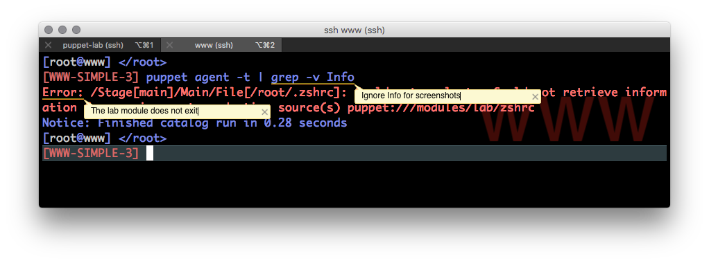

### Creating a Very Simple site.pp

In the Adding an Agent section, we observed a difference in the prompts between the two systems. We use Puppet to distribute a .dotfile to all it's agents.

## Copy the Manifest to \/etc\/puppet\/manifests\/site.pp

$$
PUP-SIMPLE-1
$$

1. Even though this is a simple manifest, it is not especially easy to type. We copy manifests for examples.
  `lab_copy e001_simple`

  lab\_copy is a shell function that executes puppet apply with a tag limiting the execution to a subset of the resources defined in the manifest.

## Execute the Agent on WWW Server

$$
WWW-SIMPLE-1
$$

1. With site.pp on the Puppet master, running the agent compiles the catalog and applies the desired changes.
  `puppet agent -t`
  

## Execute the Puppet Agent on the Puppet Master

$$
PUP-SIMPLE-2
$$

1. With site.pp on the Puppet master, running the agent compiles the catalog and applies the desired changes.

  When puppet is executed on the master it is also using site.pp. The content of .zshrc in site.pp does not exactly match the content of file copied by setup.pp.
  `puppet apply -t`

  
  

## Exec zsh to Get the New Prompt

$$
WWW-SIMPLE-2
$$

1. Now that we have created a \/root\/.zshrc, run zsh.
  `exec zsh`
  

## Edit \/etc\/puppet\/manifests\/site.pp on the Master

$$
PUP-SIMPLE-3
$$

1. Wait, you said this was simple! Puppet lint shows you an error about variables in single quoted strings! The example in 001-simple uses the `content` parameter to the file type.  It is technically simple but it isn't a very good implementation.
  `vi /etc/puppet/manifests/site.pp`
  
  

2. Writing detailed modules is beyond the scope of this lab. However, we utilize a stub of a module to take advantage of puppet's [file serving capabilities](https://docs.puppet.com/puppet/latest/reference/modules_fundamentals.html#files). Puppet provides the ability to access files from the special path puppet:\/\/\/modules\/&lt;module&gt;\/&lt;filename&gt;. We use this method to truly simplify the example.

In practice, you would generate a module with `puppet module generate <author-module>`answer the questions and use that module to store all your custom manifests. We create a bare minimum module skipping the interview questions for the purposes of this lab.

## Update manifest to copy file

# Create a minimum viable module skeleton

## Create the Partial Module Directory Structure

$$
PUP-SIMPLE-4
$$

1. Create the bare minimum module.
  `cd /root ; puppet module generate --skip-interview oracle-lab`
  

$$
PUP-SIMPLE-5
$$

1. Create the files directory.
  `mkdir /root/oracle-lab/files`

  

$$
WWW-SIMPLE-3
$$

1. On the agent apply the current config, **it will fail!**

# Add Files to the Module

$$
PUP-SIMPLE-8
$$

1. This step makes the file available to agents via the Puppet file server at puppet:\/\/\/modules\/lab\/zshrc
  `cp /root/HOL7712-Solaris-Puppet/labfiles/zshrc /root/oracle-lab/files`
2. Deploy the module.
  `cd /root/oracle-lab`
  `puppet module build`

1. Install the module
  `puppet module install --force ./pkg/oracle-lab-0.1.0.tar.gz`
  

2. In the future, we will do this using the shell function `lab_build`

3. If you are have issues you can't resolve with this step, run `lab_copy 002-simple`to use the example site.pp

## Execute Puppet Agent on the Node

$$
WWW-SIMPLE-4
$$

1. When you apply puppet now there will be a change to .zshrc, the file we are copying from is slightly different than the one included in 001-simple-site.pp.
  `puppet apply -t`
  
  

## Execute Puppet Agent on the Master

$$
PUP-SIMPLE-7
$$

1. When you apply puppet on the master there will also be a change to .zshrc 
  `puppet agent -t`
  

## Why did .zshrc change on the master too?

Site.pp applies to all agents of the master including the master if it is configured to use itself as a server.  We will cover basic node segregation in the next sections.

# Review

1. We configured puppet:agent on www:
  1. Set config\/server
  2. Refresh the service
  3. Enabled the service
  4. Stopped but did not disable the service

2. Distributed .zshrc from a single manifest.

3. Created just enough of a private \(lab\) puppet module to server files.

4. Updated site.pp to copy .zshrc to agents from the lab module.

5. Noticed that changes in  site.pp affect the agent running on the master and on www.

6. We introduced two lab specific shell functions:
  1. `lab_copy <example>` lab\_copy copies files for the next lab and supports tab expansion
  2. `lab_build`lab\_build builds and installs the custom puppet module we are using to manage our customized files and manifests.

