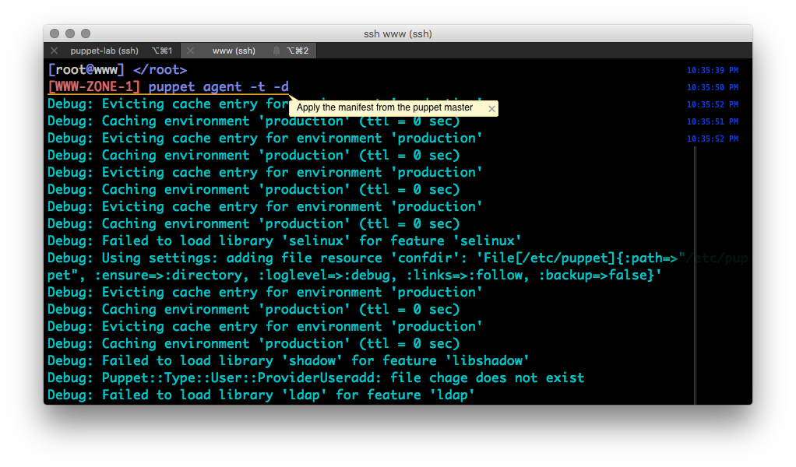
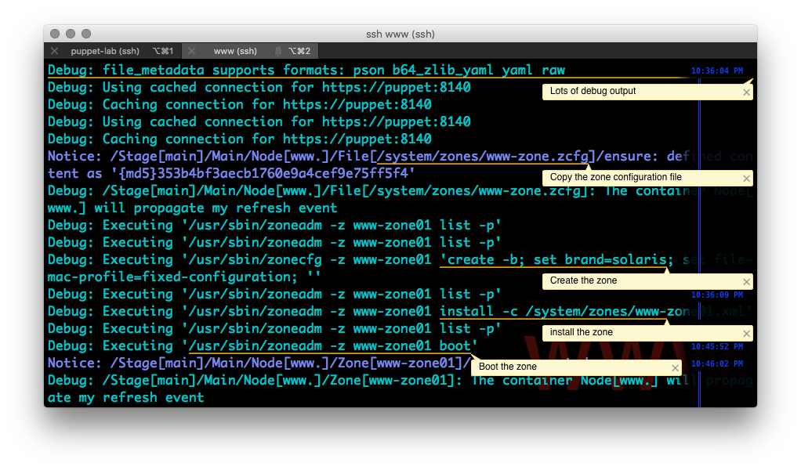

# Adding a Native Zone

We return to our lab module to provide the needed zone configuration files[^1].

## Update the Lab Module

1. Make a directory to hold the zone configuration.
  `mkdir -p /root/oracle-lab/files/zones`
2. Copy the zone configuration and profile to `/root/oracle-lab/files/zones`
  `cp -r /root/HOL7712-Solaris-Puppet/labfiles/zones/ /root/oracle-lab/files/`
3. Build and deploy the lab module. Remember that lab_build automates `puppet module build`and `puppet module install`
  `lab_build`

  [LIST]


## Copy Lab Files

1. Update site.pp[^2].
  `lab_copy e007_www_zone`
2. Review site.pp changes.
  We introduce some simple node classification here. To create the zone only on hosts named `www.*`we add a node classification.

  ```ruby
  ######
  # e007_www_zone/site.pp
  ######

  # Create the zone on all www hosts
  node /www.*/ {
  # Copy the zone configuration files
  file {
    "/system/zones/www-zone.zcfg":
    ensure => present,
    source => 'puppet:///modules/lab/zones/www-zone.zcfg';
  "/system/zones/www-zone01.xml":
    ensure => present,
    source => 'puppet:///modules/lab/zones/www-zone01.xml';
  } -> # Files must be copied before they are used
  zone { 'www-zone01':
    ensure         => 'running',
    zonecfg_export => '/system/zones/www-zone.zcfg',
    config_profile => '/system/zones/www-zone01.xml'
  }
  }
  ```

3. In a separate window, run the agent on www.
  `puppet agent -t -d`

  

4. Execution may take some time[^1].

  


[^1]: Screenshots of simple commands will be less prevalent

[^2]: This is out of order in numbering from the other examples, the flow makes more sense. This is what you get for numbering things.

[^3]: Continue with the lab.

