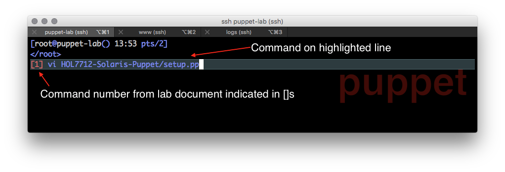
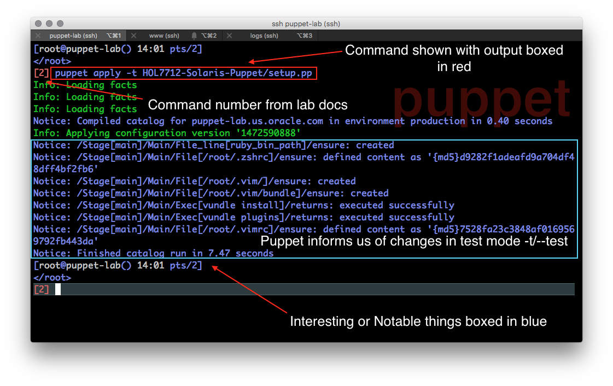

Code examples will be shown in code blocks

```ruby
package { 'puppet':
 ensure => present
}
```

Commands will also be show in code blocks

`puppet cert list`

Command output will be displayed in block quotes

> "www.us.oracle.com" \(SHA256\) 42:77:38:C8:C0:7F:0B:9B:4E:90:F7:EA:2C:76:99:48:CE:63:6B:1D:9D:DA:67:46:06:A3:AB:50:16:3E:CC:23

Screenshots will be annotated with red blocks around steps which will be executed or areas which need to be changed and blue blocks around highlighted examples. Commands will be referenced by the \[N\] in red before each command.




Images may also use inline text annotation


Command references will be shown as


$$
<SERVER>-<COMMAND-NUMBER>
$$


Thus the following is command 5 on the server puppet-lab


$$
PUP-5
$$


Command 10 on WWW


$$
WWW-10
$$


