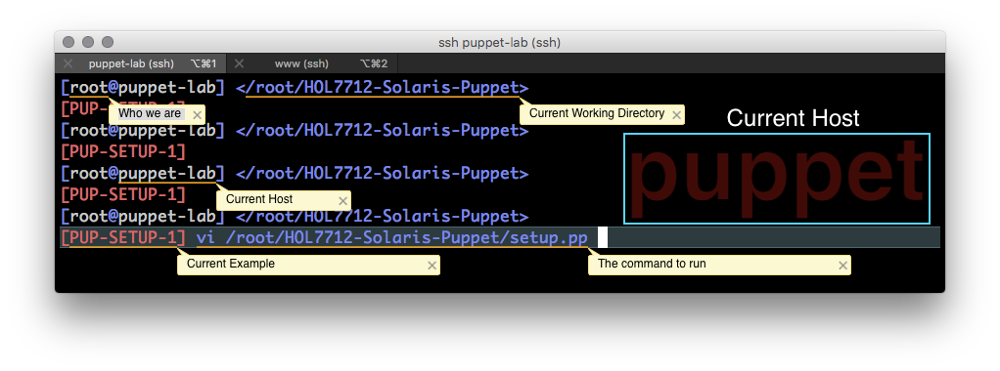
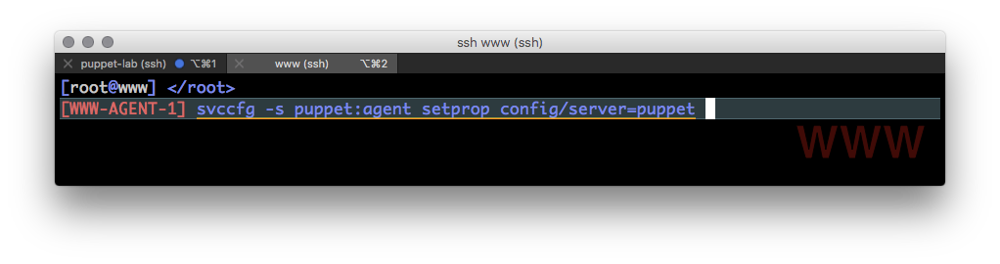

Code examples are shown in code blocks:

```ruby
package { 'puppet':
 ensure => present
}
```

Commands are also shown in code blocks:

`puppet cert list`

Command output is displayed in block quotes:

> "www.oracle.lab" \(SHA256\) 42:77:38:C8:C0:7F:0B:9B:4E:90:F7:EA:2C:76:99:48:CE:63:6B:1D:9D:DA:67:46:06:A3:AB:50:16:3E:CC:23

Command references are shown as:


$$
<Server>-<Example>-<Command>
$$


Thus, the following is Command 5 on the server puppet-lab in the Setup example:


$$
PUP-SETUP-1
$$




Command 10 on WWW is shown as:


$$
WWW-AGENT-1
$$



